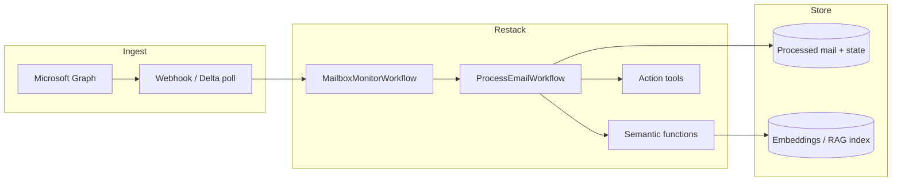

# Plan: Outlook Mailbox Monitor with Semantic Understanding

Monitor a Microsoft Outlook mailbox in near real time, understand each message by meaning (not keywords alone), then route actions—alerts, tickets, drafts, RAG updates—through Restack workflows.

## Goal

Turn inbox traffic into structured, actionable signals:

| Capability | Example |
|---|---|
| Intent classification | support request, invoice, meeting ask, spam, FYI |
| Entity extraction | sender org, amounts, deadlines, order IDs, people |
| Priority / urgency | SLA risk vs low-priority newsletter |
| Semantic search | “find emails about Q3 renewal delays” |
| Thread awareness | link replies to the same conversation |
| Action routing | notify Slack, create todo, draft reply, escalate |

Out of scope for v1: auto-sending replies without human approval, full CRM sync, mailbox write-back beyond draft creation.

## Recommended architecture



Reuse patterns already in this repo:

- **Interval schedule** (`production_demo/schedule_interval.py`) for polling fallback
- **Parent → child workflows** (`child_workflows`) so each email is an isolated, retryable unit
- **LLM + tools** (`agent_todo`) for actions after classification
- **RAG lookup** (`agent_rag`) for semantic retrieval over prior mail / policy docs
- **Human-in-the-loop** (`agent_humanloop`) before any outbound reply

## 1. Mailbox access (Microsoft Graph)

### Auth

- Prefer **app-only** (client credentials) for a shared / service mailbox, or **delegated** for a user mailbox.
- Azure AD app registration with least privilege:
  - `Mail.Read` (or `Mail.ReadWrite` only if drafts are required)
  - `Mail.ReadBasic` is insufficient for body + attachments
  - Optional: `User.Read` for mailbox identity
- Store secrets in env / Restack Cloud secrets (`AZURE_TENANT_ID`, `AZURE_CLIENT_ID`, `AZURE_CLIENT_SECRET`, `MAILBOX_UPN`).

### Ingest modes

| Mode | When to use | Notes |
|---|---|---|
| **Graph change notifications (webhook)** | Primary, low latency | Subscribe to `/users/{id}/mailFolders('Inbox')/messages`; validate + renew subscriptions (~3 days) |
| **Delta query poll** | Fallback / bootstrap | `GET /users/{id}/mailFolders/Inbox/messages/delta`; persist `@odata.deltaLink` |
| **Scheduled poll** | Simple v1 | Restack schedule every 1–5 minutes; track `receivedDateTime` / `internetMessageId` watermark |

**v1 recommendation:** scheduled delta poll via Restack (simple, durable). Add webhooks in v2 for sub-minute latency.

### Dedup & state

Persist per message:

- `internetMessageId` / Graph `id`
- `conversationId`
- processing status (`seen`, `classified`, `actioned`, `failed`)
- watermark / delta link

Never re-run expensive LLM work for already-processed IDs unless forced.

## 2. Semantic understanding pipeline

Each new message runs as `ProcessEmailWorkflow` (child):

1. **Normalize** — strip HTML → plain text; truncate long bodies; capture subject, from, to, cc, received time, attachments metadata.
2. **Fast filters** — skip auto-replies, calendar noise, known newsletters (rules before LLM).
3. **Classify (structured LLM output)** — intent, urgency (`low|medium|high|critical`), language, needs_reply, categories.
4. **Extract** — entities (people, orgs, amounts, dates, ticket/order IDs) as JSON schema.
5. **Embed** — vectorize `subject + body summary` for semantic search / RAG.
6. **Thread context** — fetch prior messages in `conversationId` (capped) and pass summary into the LLM for continuity.
7. **Decide actions** — rule + LLM policy map (e.g. `invoice` → finance channel; `urgent support` → page on-call).
8. **Act / escalate** — tool calls; human approval for outbound drafts.

### Example structured output

```json
{
  "intent": "support_request",
  "urgency": "high",
  "needs_reply": true,
  "summary": "Customer reports API timeouts since Tuesday on production.",
  "entities": {
    "customer": "Acme Corp",
    "product": "Payments API",
    "deadline": null
  },
  "suggested_actions": ["notify_slack", "create_todo", "draft_reply"],
  "confidence": 0.86
}
```

Use a schema-constrained LLM call (JSON mode / tool schema) so Restack functions stay typed and testable.

## 3. Restack module layout (proposed)

```
agent_outlook/
  PLAN.md                 # this document
  README.md               # run instructions (later)
  schedule_monitor.py     # schedule MailboxMonitorWorkflow
  src/
    client.py
    services.py
    functions/
      graph_auth.py
      fetch_delta.py
      normalize_email.py
      classify_email.py
      extract_entities.py
      embed_email.py
      persist_email.py
      notify_slack.py      # or generic webhook
      draft_reply.py
      llm_chat.py
    workflows/
      mailbox_monitor.py  # parent: poll → spawn children
      process_email.py    # child: semantic pipeline + actions
    agents/
      mailbox_agent.py    # optional chat UI over mailbox RAG
```

### Workflow responsibilities

**`MailboxMonitorWorkflow` (parent, scheduled)**

- Load delta link / watermark
- Call `fetch_delta`
- For each new message id → `child_execute(ProcessEmailWorkflow)`
- Persist new delta link
- Rate-limit LLM queue via Restack `ServiceOptions` (same idea as `production_demo`)

**`ProcessEmailWorkflow` (child)**

- Normalize → classify → extract → embed → persist
- Branch on policy → notify / create todo / draft
- Failures retry; poison messages marked `failed` with reason

**`MailboxAgent` (optional)**

- Chat interface: “What urgent vendor emails arrived today?”
- RAG over embedded mail + classification store

## 4. Semantics deeper than classification

To make “semantic understanding” durable:

1. **Embeddings index** — store vectors keyed by message id; query by meaning.
2. **Policy / playbook RAG** — retrieve internal SOPs (“how we handle refunds”) when classifying or drafting.
3. **Sender / org memory** — optional profile: last intents, open issues, VIP flag.
4. **Confidence gates** — below threshold → human review queue instead of auto-action.

## 5. Security & compliance

- Least-privilege Graph scopes; no blanket `Mail.ReadWrite` until needed
- Encrypt secrets; never log full email bodies in production
- PII handling: redact or restrict fields before third-party LLM if required
- Retention policy for stored bodies / embeddings
- Audit trail: who/what acted on each message (Restack run ids)

## 6. Phased delivery

### Phase 0 — Foundations
- Azure app + mailbox access smoke test
- Restack skeleton (`client`, `services`, empty monitor workflow)
- Persistence for message ids + delta link (SQLite/Postgres)

### Phase 1 — Reliable ingest
- Scheduled delta poll every N minutes
- Dedup, normalize, store raw metadata + body text
- Metrics: messages seen / skipped / failed

### Phase 2 — Semantics
- Structured classify + extract functions
- Embeddings + simple semantic search
- Urgency / intent dashboard via Restack UI + stored results

### Phase 3 — Actions
- Slack/webhook notify on high urgency
- Todo creation (reuse `agent_todo` pattern)
- Draft reply with human-in-the-loop approval

### Phase 4 — Hardening
- Graph webhooks + subscription renewal workflow
- Attachment OCR path (reuse `pdf_ocr` ideas for PDFs)
- Rate limits, backoff, poison-queue handling
- Evaluation set: labeled emails → precision/recall on intent/urgency

## 7. Key design decisions

| Decision | Choice | Why |
|---|---|---|
| Ingest v1 | Delta poll on Restack schedule | Durable, simple, fits existing examples |
| Processing unit | One child workflow per email | Isolation, retries, visibility |
| LLM output | Strict JSON schema | Reliable routing, testable |
| Auto-send | Off by default | Safety; human-loop for drafts |
| Search | Embeddings + metadata filters | True semantic recall beyond keywords |

## 8. Success criteria

- New Inbox mail processed within one poll interval
- No duplicate LLM processing for the same `internetMessageId`
- ≥ target accuracy on a labeled sample for intent + urgency
- High-urgency items produce a notify action with summary + link
- Operator can ask natural-language questions over recent mail via agent

## 9. Open questions (resolve before build)

1. Shared mailbox vs user mailbox?
2. Which actions are automated vs approval-gated?
3. Where to store state (local DB vs managed Postgres)?
4. Which LLM (Restack-hosted vs Azure OpenAI for data residency)?
5. Languages / attachment types that must be supported in v1?

## Next implementation step

Implement Phase 0–1 under `agent_outlook/` mirroring `production_demo` + `child_workflows`: schedule a monitor workflow, Graph delta fetch stub, and per-email child workflow with classify placeholder.
