# n8n end-to-end templates

Free workflow templates from the public [n8n library](https://n8n.io/workflows/), picked because each one runs a full path: a trigger, the work, and a result. Captured on 27 September 2026. The library had **12,570** workflows that day.

Search covered the official API (`https://api.n8n.io/templates/search`), the template site, and other public catalogs. A title search for “end to end” only returns 12 workflows, and several of those are paid. The templates below are the complete free ones that match the kinds of agents in this repository: chat, tools, RAG, documents, messaging, human approval, voice, and video.

Every template here has `price: null` on the official API, so it imports with **Use for free**. You still attach your own credentials after import.

## How to use one

1. Open the template link.
2. Choose **Use for free**. That copies the workflow into your n8n (cloud or the desktop app).
3. Open each node that shows a credential warning and connect your own account.
4. Run the manual or chat trigger once before you turn the workflow on.

Self-hosted n8n uses the same library. From the editor you can also use **Import from URL** with the template page.

Workflow JSON is not stored in this folder. Imports can carry credential names, so the files here are the catalog, the live-page screenshots, and canvas maps drawn from public node positions.

## The library

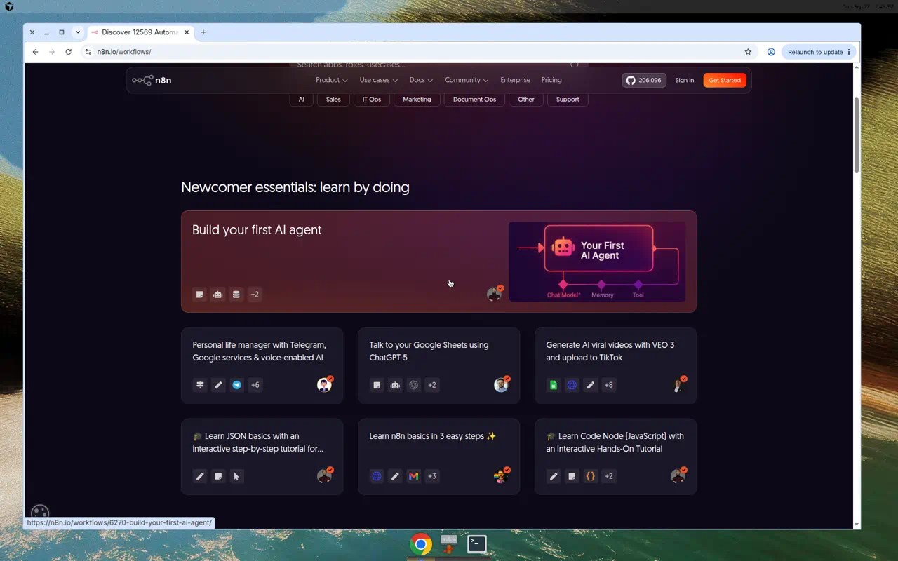

Categories on the official API include AI, AI Chatbot, AI RAG, AI Summarization, Multimodal AI, Document Extraction, Support Chatbot, and 24 more. AI alone is about 8,700 workflows.

## Which one to open

| Use it for | Template | Views | Steps | Closest example here |
| --- | --- | --- | --- | --- |
| First agent | [Build your first AI agent](https://n8n.io/workflows/6270/) | 1,239,599 | 6 | `agent_chat` |
| Chat plus web search | [AI agent chat](https://n8n.io/workflows/1954/) | 1,828,285 | 5 | `agent_chat` |
| Several tools | [Interactive AI agent with tools](https://n8n.io/workflows/5819/) | 68,468 | 11 | `agent_tool` |
| Local RAG | [Local chatbot with RAG](https://n8n.io/workflows/5148/) | 138,644 | 11 | `agent_rag` |
| RAG with no extra database | [RAG starter](https://n8n.io/workflows/5010/) | 114,253 | 8 | `agent_rag` |
| Ask a spreadsheet | [Talk to your Google Sheets](https://n8n.io/workflows/7639/) | 158,174 | 5 | `agent_tool` |
| WhatsApp text, voice, image, PDF | [WhatsApp chatbot with RAG](https://n8n.io/workflows/4827/) | 254,435 | 32 | `agent_rag` |
| WhatsApp sales agent | [Building your first WhatsApp chatbot](https://n8n.io/workflows/2465/) | 537,038 | 18 | `agent_telephony` |
| Telegram chat and images | [Telegram AI chatbot](https://n8n.io/workflows/1934/) | 234,045 | 12 | `agent_chat` |
| Support across five channels | [Multi-channel support RAG](https://n8n.io/workflows/11807/) | 6,579 | 77 | `agent_humanloop` |
| Approve email before send | [Human-in-the-loop email](https://n8n.io/workflows/2907/) | 39,665 | 10 | `agent_humanloop` |
| Approve follow-ups | [Follow-up reminders](https://n8n.io/workflows/3123/) | 15,609 | 16 | `agent_humanloop` |
| PDF OCR into search | [PDF RAG with Mistral and Qdrant](https://n8n.io/workflows/4400/) | 47,943 | 29 | `pdf_ocr` |
| Parse invoices and files | [LlamaParse document extraction](https://n8n.io/workflows/3005/) | 19,680 | 36 | `pdf_ocr` |
| Generate and post video | [Veo 3 video to social](https://n8n.io/workflows/5035/) | 285,464 | 26 | `agent_video` |
| Outbound sales calls | [Retell voice agent](https://n8n.io/workflows/12856/) | 2,318 | 11 | `agent_voice` |
| Support calls that book time | [ElevenLabs voice agent](https://n8n.io/workflows/8074/) | 8,438 | 9 | `agent_voice` |

Views come from `https://api.n8n.io/templates/workflows/{id}` on the capture date. Steps are the workflow nodes with sticky notes left out. `catalog.json` has the creator, categories, every step name, and a short summary for each row.

## Agents and chat

### Build your first AI agent

[Open template 6270](https://n8n.io/workflows/6270/). Chat trigger, Gemini, conversation memory, and two tools: Get News and Get Weather.

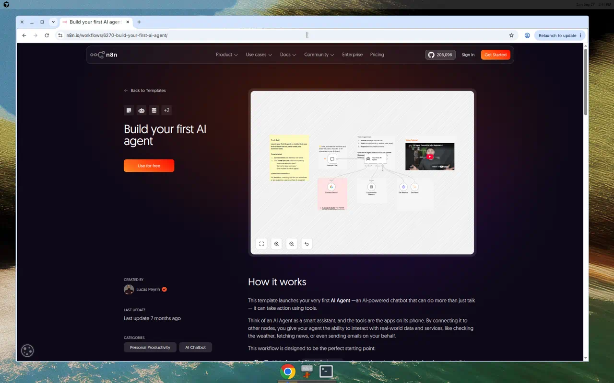

### AI agent chat

[Open template 1954](https://n8n.io/workflows/1954/). The most viewed template in the library. One agent, an OpenAI chat model, window memory, and SerpAPI.

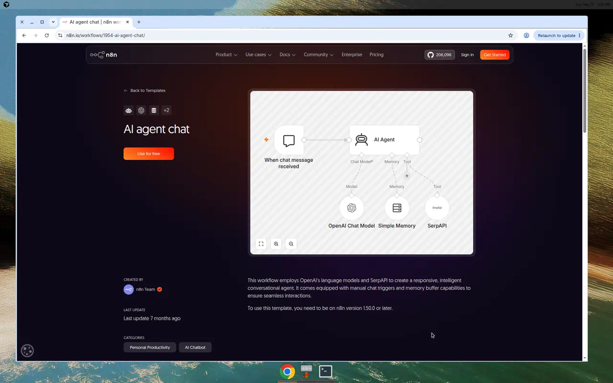

### Interactive agent with tools

[Open template 5819](https://n8n.io/workflows/5819/). The chat window can call a joke tool, date math, Wikipedia, a password generator, a loan calculator, and the n8n blog RSS feed. Gemini and OpenAI are both on the canvas.

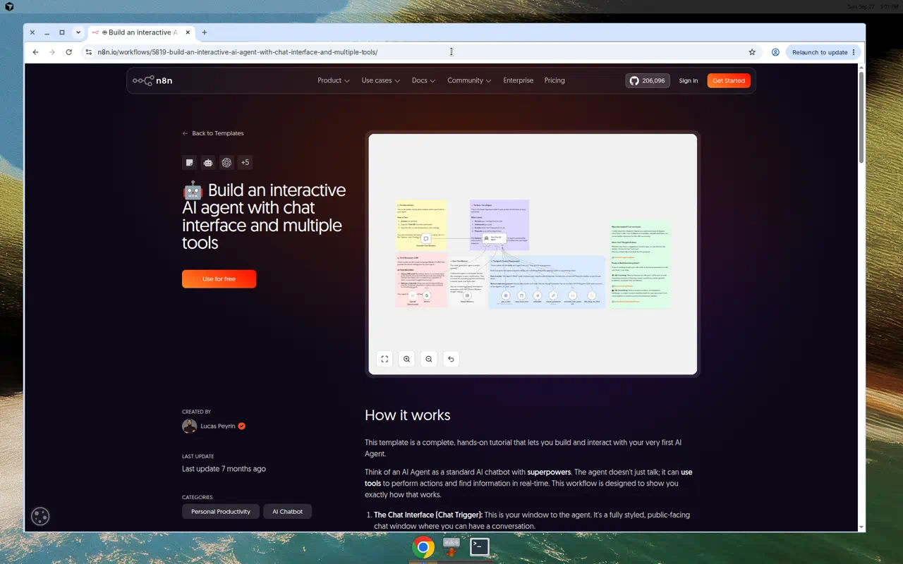

### Talk to a Google Sheet

[Open template 7639](https://n8n.io/workflows/7639/). A chat window asks questions about rows in Google Sheets. Memory keeps the thread.

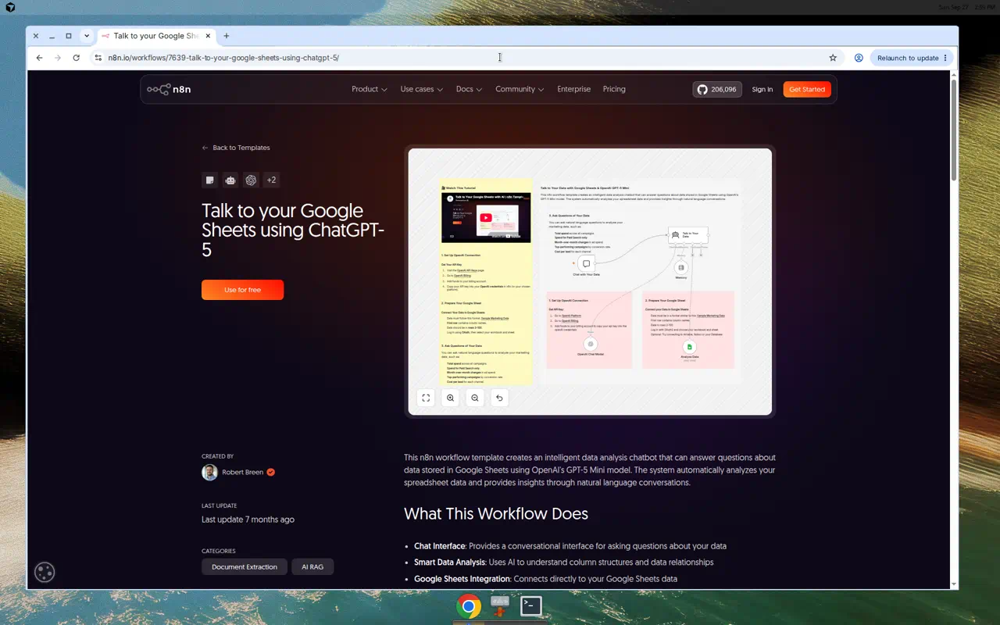

### Telegram AI chatbot

[Open template 1934](https://n8n.io/workflows/1934/). A Telegram trigger answers normal text with OpenAI. A separate command generates an image and sends it back.

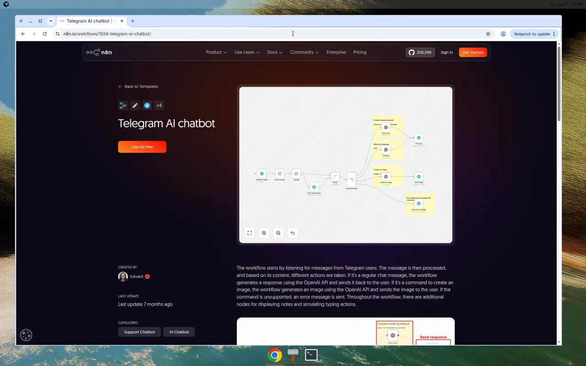

## RAG and documents

### Local RAG chatbot

[Open template 5148](https://n8n.io/workflows/5148/). A form loads PDFs into Qdrant with Ollama embeddings. A second path answers chat from that store with a local Ollama model. Nothing in this one calls a hosted LLM.

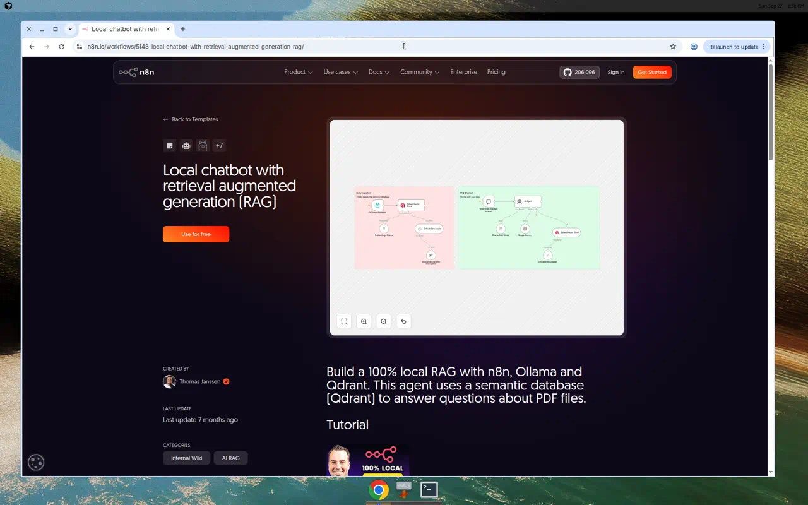

### RAG starter

[Open template 5010](https://n8n.io/workflows/5010/). Upload a file into n8n’s simple vector store, then chat. OpenAI does the embeddings and the answers. No Qdrant or Supabase project to create first.

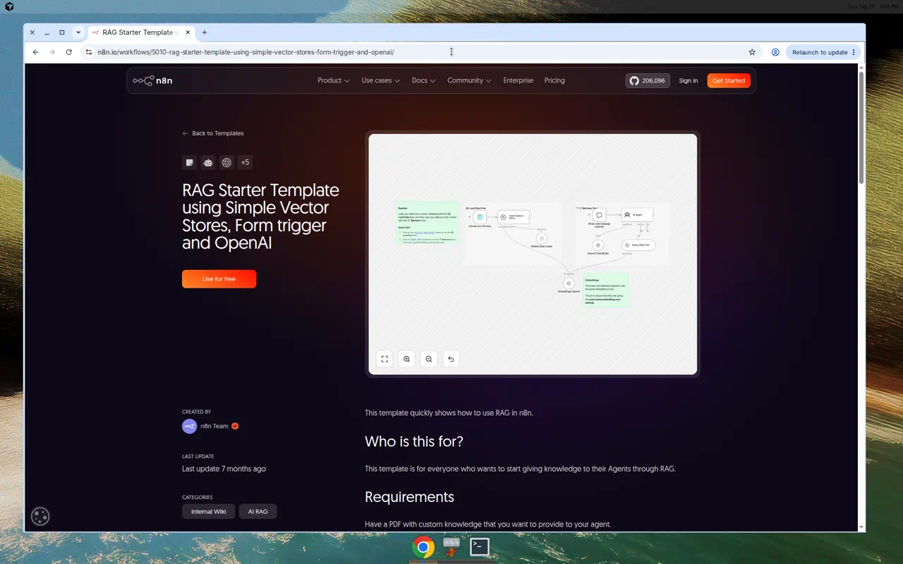

### PDF OCR into Qdrant

[Open template 4400](https://n8n.io/workflows/4400/). Mistral OCR reads PDFs, the text is chunked into Qdrant, and a Gemini question-and-answer chain retrieves from that store. Ingest and ask are both on the same workflow.

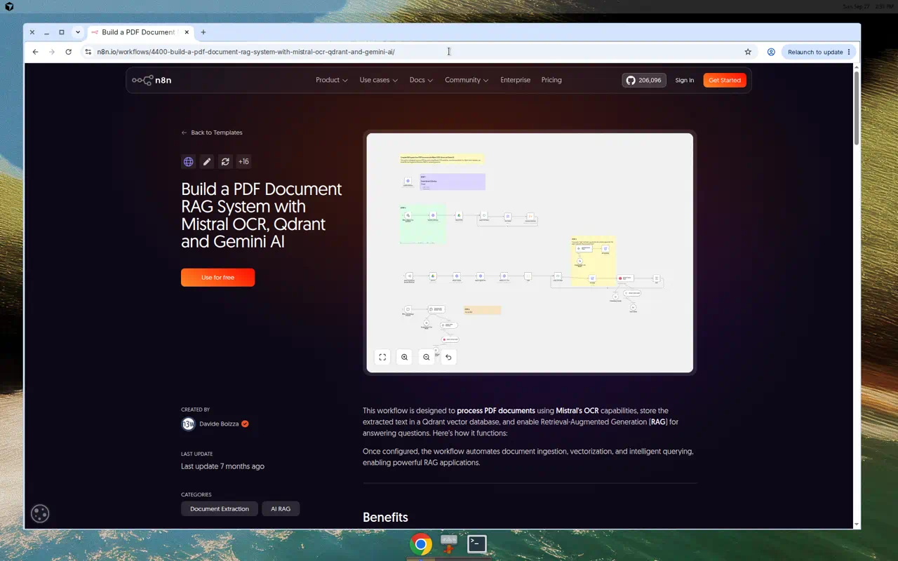

### LlamaParse document extraction

[Open template 3005](https://n8n.io/workflows/3005/). Files arrive by webhook or Gmail. LlamaParse extracts the text, a model pulls invoice fields, and the result is written to Drive and Sheets and sent on Telegram. The map below is the full canvas; the live page is the link.

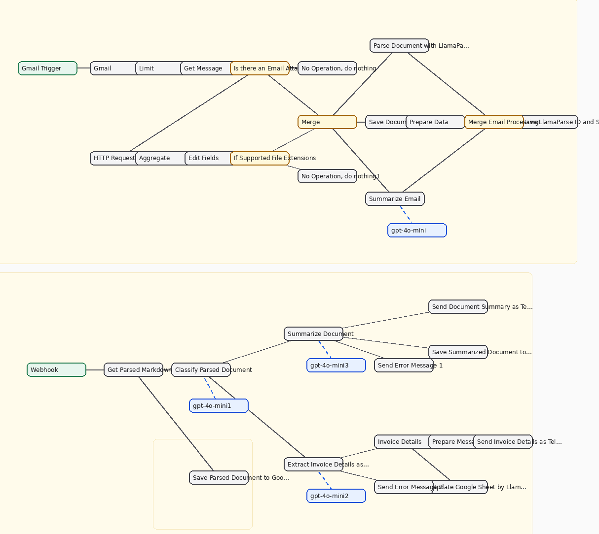

## Messaging

### WhatsApp for text, voice, images, and PDF

[Open template 4827](https://n8n.io/workflows/4827/). The WhatsApp trigger branches by file type, including voice notes and spreadsheets. A knowledge-base agent searches a MongoDB vector store before it replies.

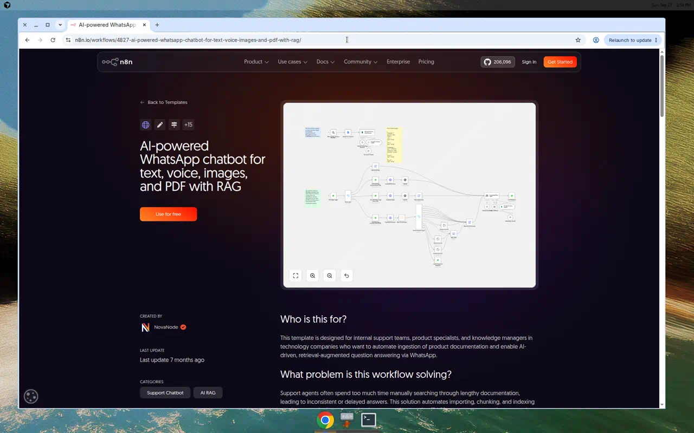

### WhatsApp sales agent

[Open template 2465](https://n8n.io/workflows/2465/). One path builds a product-catalog vector store from a brochure. The other path is the sales agent that answers WhatsApp messages from that catalog.

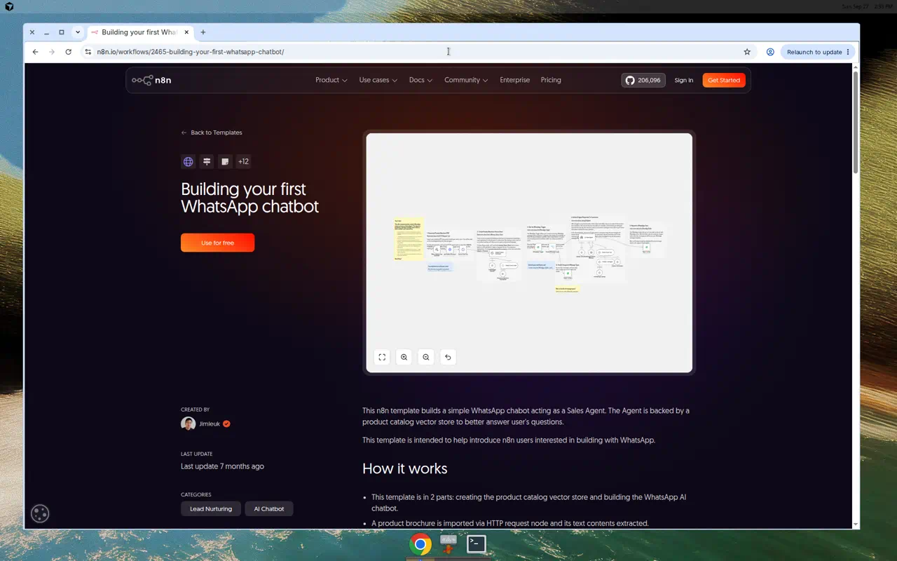

### Support on email, chat, WhatsApp, Slack, and Discord

[Open template 11807](https://n8n.io/workflows/11807/). Every channel is normalized, then one OpenAI agent answers from a Supabase vector store. Low confidence, negative sentiment, or an explicit ask for a person opens a Zendesk ticket and logs the turn to Google Sheets. The screenshot is one region of a 77-step canvas. The full map is `visuals/diagrams/11807.png`.

## A person still approves the send

### Human-in-the-loop email

[Open template 2907](https://n8n.io/workflows/2907/). IMAP receives the mail, a model summarizes it and drafts a reply, and an approval step sits in front of Send.

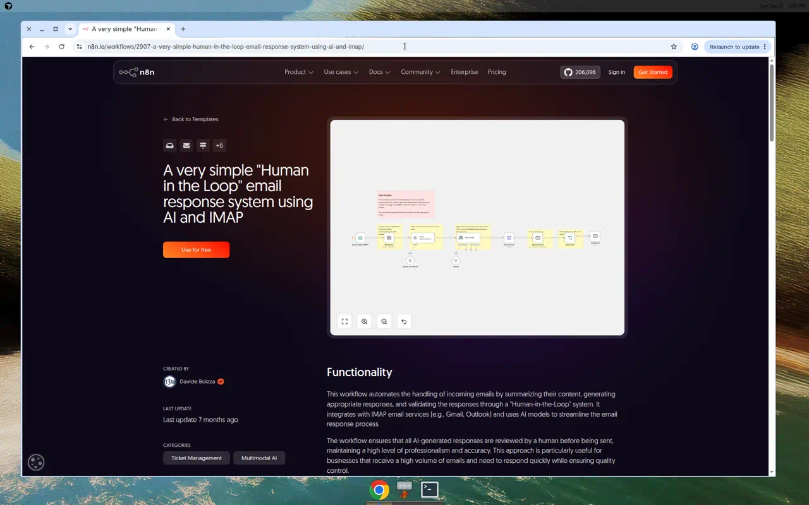

### Follow-up reminders

[Open template 3123](https://n8n.io/workflows/3123/). A schedule reads past meetings, an agent drafts the next follow-up, and the message waits for approval before Gmail sends it.

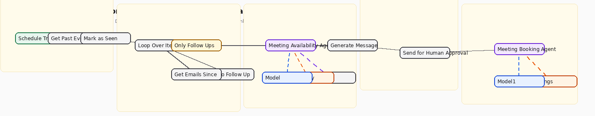

## Voice

### Outbound calls from a sheet

[Open template 12856](https://n8n.io/workflows/12856/). A new lead in Google Sheets is called with Retell only when it is 8am–5pm in the lead’s timezone. Call status is written back to the sheet.

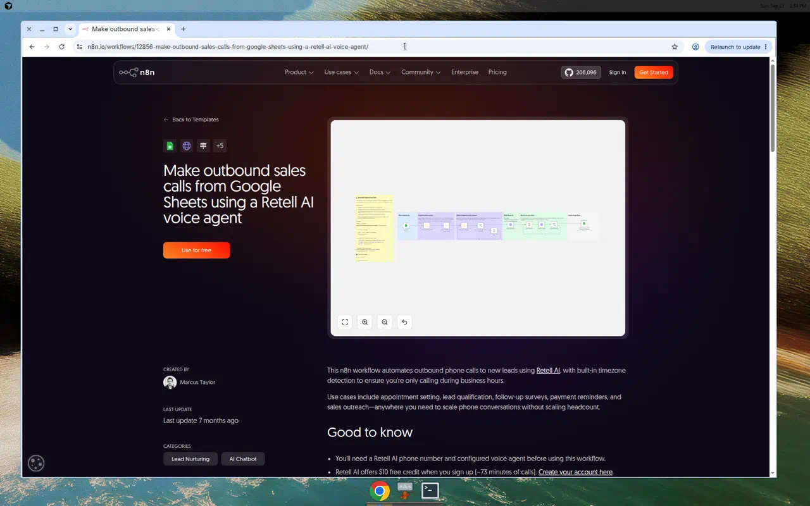

### Support voice agent that books a calendar

[Open template 8074](https://n8n.io/workflows/8074/). ElevenLabs sends the caller’s turn to a GPT-5 agent. The agent checks a knowledge base, looks at calendar availability, creates the appointment, and emails a confirmation. The picture is the full canvas published on the template.

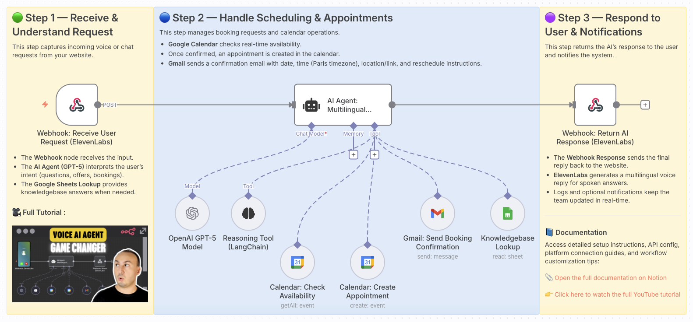

## Video

### Generate a clip and post it

[Open template 5035](https://n8n.io/workflows/5035/). A daily trigger asks an agent for a video idea, turns that into a Veo 3 prompt, waits for the render, then Blotato posts the file to Instagram, YouTube, TikTok, Facebook, Threads, X, LinkedIn, Bluesky, and Pinterest. The picture is the full canvas published on the template.

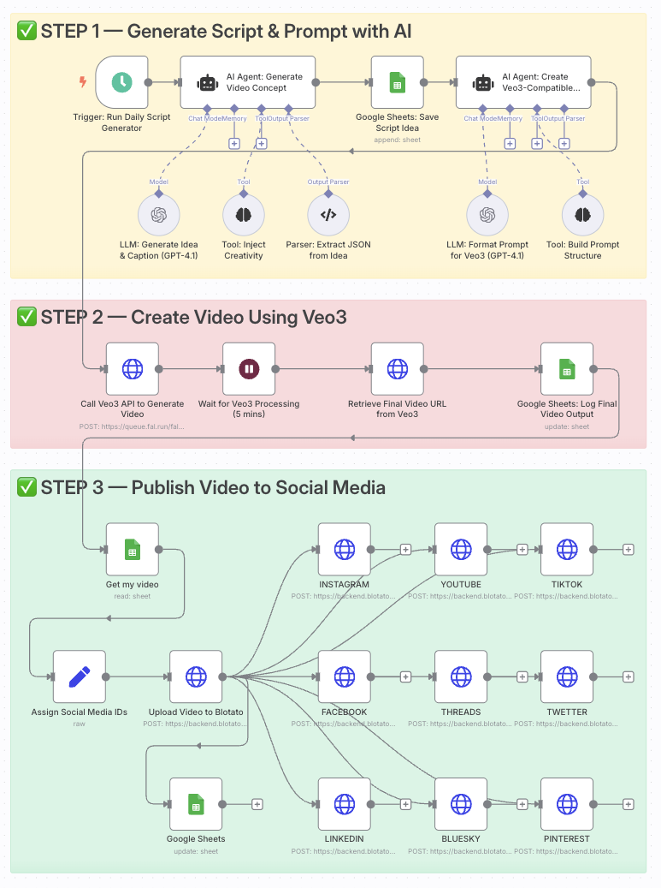

## Paid templates that use the words “end to end”

These showed up in the title search and are not free, so they are not imported here:

- [AI real estate agent: web, data, and voice](https://n8n.io/workflows/4368/) (listed at $249, 45 nodes)
- [AI blog research and writer](https://n8n.io/workflows/9079/) (listed at $30, 51 nodes)
- [Hiring with Keka, Sheets, Gmail, and GPT-4](https://n8n.io/workflows/13517/) (listed at $150)

## Other places that publish importable workflows

- [n8n.io/workflows](https://n8n.io/workflows/) is the source of truth. The in-app Templates tab opens this library.
- [n8nworkflows.xyz](https://n8nworkflows.xyz/) is an independent catalog with a download API (`GET /api/download/{id}`).
- [scrapernode/awesome-n8n-templates](https://github.com/scrapernode/awesome-n8n-templates) mirrors thousands of community JSON files on GitHub.
- [dvasquez08/n8n-workflows](https://github.com/dvasquez08/n8n-workflows) and [paoloronco/n8n-templates](https://github.com/paoloronco/n8n-templates) are smaller sets, and both include screenshots next to the JSON.

## Files

- `catalog.json` — id, views, node names, summary, and image paths
- `visuals/screenshots/` — live editor captures from n8n.io
- `visuals/creator/` — full-canvas images the template authors embedded in the description
- `visuals/diagrams/` — maps drawn from the public node positions and connections
